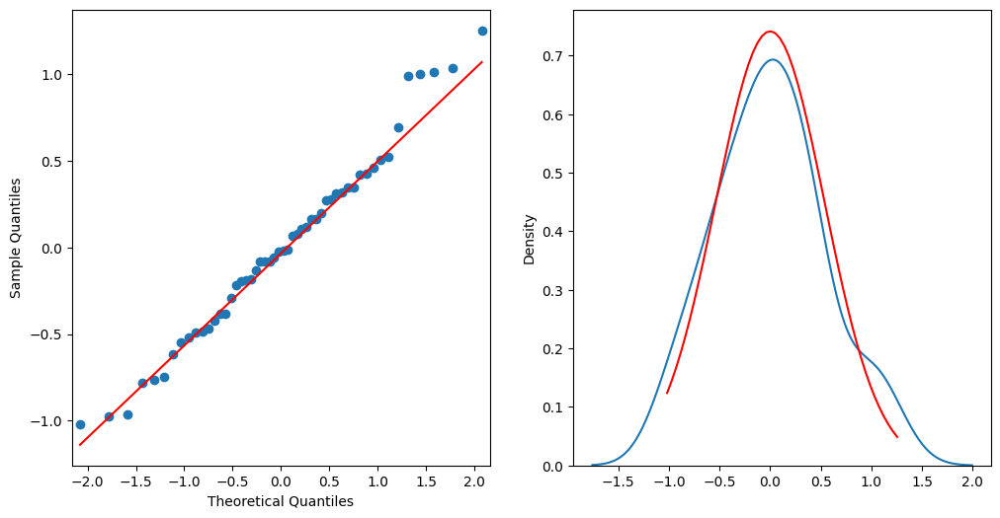
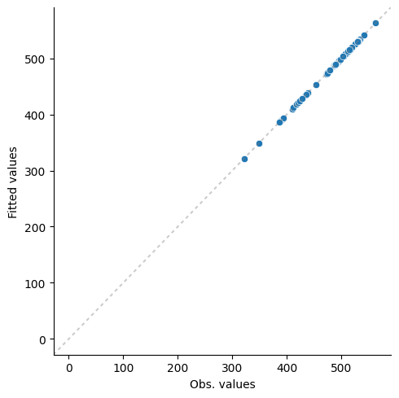
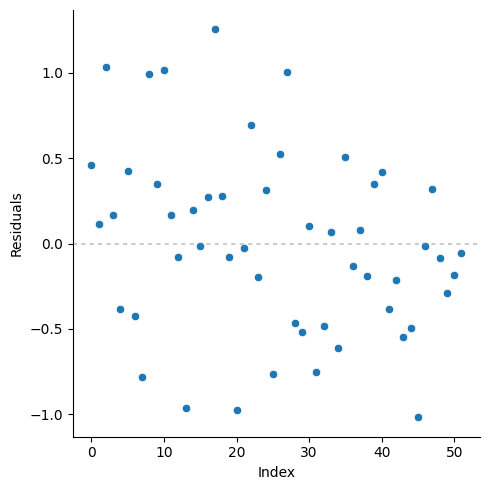
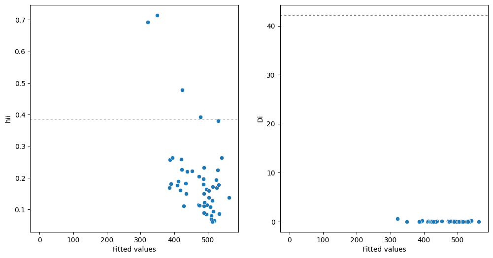

The scratch_models is a regression library that implements a Multiple Linear Regression from scratch. It was inspired by the amazing *R programming language* and *Python statsmodels library*. The ideias here is to make it easy for you to check some assumptions around your linear regression model. Therefore, this package currently supports these features:

- You can fit a linear regression model
- It calculates metrics for your model, such as the Coefficient of Determination, ($R^2$ Adj) and RMSE.
- You also check assumptions of the linear model by plotting *residuals*, cook distance, check if there are influence observations.

**All the statistics calculated in library was calculated using Montgomery book (Applied Statistics and Probability for Engineers) and that's why may be some differences from R or Python implementation. For example, the implementation of rstudent and rstandard in R language is different from this library, which uses Montgomery book.**

## Fit the model

It works similarly to LinearRegression class from scikit-learn, you just need to have a dataset and thus divide it by y and X. Here's an example:


```python
import pandas as pd
from scratch_models import linear_reg

data = (
    pd.read_csv("https://raw.githubusercontent.com/m-clark/generalized-additive-models/master/data/pisasci2006.csv")
    .drop(columns="Country").dropna().reset_index(drop=True)
)

X = data.drop(columns="Overall")
y = data.Overall

reg = linear_reg.LinearRegression(X=X, y=y, intercept=True).fit()
reg.summary()
```

                                    LinearRegression                                
    ********************************************************************************
    Dep. Variable:                   Overall   R-squared:                      1.000
    Log-Likelihood:                  -42.081   Adj. R-squared:                 1.000
    F-statistic:                   46123.134   Prob (F-statistic):             0.000
    Df Model:                          9.000   Df Residuals:                  42.000
    BIC:                             123.674   AIC:                          104.161
    ********************************************************************************
                        coef      std err    t          P>|t|      [0.025     0.975]    
    --------------------------------------------------------------------------------
    Intercept          14.9487    4.072      3.672      6.75e-04   6.732      23.165    
    Issues             0.2103     0.013      16.393     < 2e-16    0.184      0.236     
    Explain            0.4429     0.008      55.882     < 2e-16    0.427      0.459     
    Evidence           0.3191     0.012      27.436     < 2e-16    0.296      0.343     
    Interest           -0.0073    0.005      -1.592     0.119      -0.016     0.002     
    Support            0.0038     0.006      0.649      0.520      -0.008     0.016     
    Income             16.4550    17.442     0.943      0.351      -18.745    51.655    
    Health             13.9542    15.536     0.898      0.374      -17.399    45.308    
    Edu                17.7537    16.934     1.048      0.300      -16.420    51.928    
    HDI                -46.9743   49.003     -0.959     0.343      -145.867   51.918    
    ********************************************************************************
    Norm (Statistic):                 0.9797
    Norm (p-value):                   0.5112
    Het (Statistic):                  5.2365
    Het (p-value)                     0.8132


As you saw, you just need to pass the individuals and dependent variable to the LinearRegression class and you can use .summary all the statistics  hipotheses tests for you model. Of course, you can also get some metrics and statistics for you model:


```python
reg.coefficients()
reg.sigma()
reg.fitted()
reg.residuals()
```


    array([ 0.460456  ,  0.11787601,  1.03669066,  0.16634294, -0.38206924,
            0.42524628, -0.42336435, -0.77909199,  0.99161009,  0.34811919,
            1.01692896,  0.16682121, -0.07800345, -0.96267588,  0.19939135,
           -0.01221025,  0.2723585 ,  1.25516055,  0.27718729, -0.08047981,
           -0.97331574, -0.02399017,  0.6938535 , -0.1941836 ,  0.31217784,
           -0.76473147,  0.52468951,  1.00515217, -0.46506781, -0.52070414,
            0.10533082, -0.74979352, -0.48540132,  0.06637091, -0.61346109,
            0.50590986, -0.13404799,  0.0785789 , -0.18743462,  0.3470004 ,
            0.42101821, -0.38202862, -0.21551869, -0.54839593, -0.49203755,
           -1.0177776 , -0.01461853,  0.31769263, -0.08234455, -0.28989388,
           -0.1831754 , -0.05614716])


scratch models can also support regression residuals, studentized residuals and standardized residuals:


```python
reg.rstudent()
reg.rstandard()
```


    array([ 0.76951298,  0.19699411,  1.73251499,  0.27799192, -0.63851322,
            0.71067059, -0.7075255 , -1.3020167 ,  1.65717645,  0.58177597,
            1.69948928,  0.27879121, -0.13035919, -1.60882167,  0.33322236,
           -0.02040573,  0.45516489,  2.09762135,  0.46323474, -0.13449766,
           -1.62660297, -0.04009232,  1.15956633, -0.32451918,  0.52171088,
           -1.27801743,  0.87685987,  1.67980794, -0.77722023, -0.87019954,
            0.17602862, -1.25305317, -0.81120154,  0.11091892, -1.02521473,
            0.84547537, -0.22402069,  0.13132087, -0.3132403 ,  0.57990626,
            0.70360463, -0.63844532, -0.36017434, -0.91647798, -0.822292  ,
           -1.70090752, -0.02443045,  0.53092717, -0.13761402, -0.48446998,
           -0.3061223 , -0.09383299])


You may also want to predict in new data, so you can use .predict method for it:


```python
reg.predict(X=X)
```


    array([390.539544  , 526.88212399, 509.96330934, 509.83365706,
           390.38206924, 433.57475372, 534.42336435, 438.77909199,
           541.00838991, 387.65188081, 491.98307104, 512.83317879,
           496.07800345, 531.96267588, 562.80060865, 495.01221025,
           515.7276415 , 471.74483945, 503.72281271, 491.08047981,
           393.97331574, 508.02399017, 453.3061465 , 475.1941836 ,
           530.68782216, 422.76473147, 321.47531049, 488.99484783,
           488.46506781, 486.52070414, 409.89466918, 412.74979352,
           525.48540132, 529.93362909, 487.61346109, 497.49409014,
           474.13404799, 348.9214211 , 418.18743462, 478.6529996 ,
           435.57898179, 488.38202862, 519.21551869, 488.54839593,
           503.49203755, 513.0177776 , 421.01461853, 385.68230737,
           424.08234455, 515.28989388, 489.1831754 , 428.05614716])


## Diagnostic analysis

As was said before, this library can also help you with diagnostic analysis of the model. In the summary, if you didn't notice, you have normality and heteroscedasticity tests. By default it makes Shapiro-Wilk and Breusch-Pagan tests. Currently, this library supports:

- Normality: Lilliefors (lilliefors), Shapiro-Wilk (shapiro) and Anderson-Darling (anderson)
- Heteroscedasticity: Breusch-Pagan (breusch) and Goldfeld-Quandt (gold)

Here's an example:


```python
reg.summary(test_norm="anderson", test_het="gold")
```

                                    LinearRegression                                
    ********************************************************************************
    Dep. Variable:                   Overall   R-squared:                      1.000
    Log-Likelihood:                  -42.081   Adj. R-squared:                 1.000
    F-statistic:                   46123.134   Prob (F-statistic):             0.000
    Df Model:                          9.000   Df Residuals:                  42.000
    BIC:                             123.674   AIC:                          104.161
    ********************************************************************************
                        coef      std err    t          P>|t|      [0.025     0.975]    
    --------------------------------------------------------------------------------
    Intercept          14.9487    4.072      3.672      6.75e-04   6.732      23.165    
    Issues             0.2103     0.013      16.393     < 2e-16    0.184      0.236     
    Explain            0.4429     0.008      55.882     < 2e-16    0.427      0.459     
    Evidence           0.3191     0.012      27.436     < 2e-16    0.296      0.343     
    Interest           -0.0073    0.005      -1.592     0.119      -0.016     0.002     
    Support            0.0038     0.006      0.649      0.520      -0.008     0.016     
    Income             16.4550    17.442     0.943      0.351      -18.745    51.655    
    Health             13.9542    15.536     0.898      0.374      -17.399    45.308    
    Edu                17.7537    16.934     1.048      0.300      -16.420    51.928    
    HDI                -46.9743   49.003     -0.959     0.343      -145.867   51.918    
    ********************************************************************************
    Norm (Statistic):                 0.2475
    Norm (p-value):                   0.5390
    Het (Statistic):                  0.4717
    Het (p-value)                     0.9283


You can also plot the graphics for normality, autocorrelation, linearity, Homoscedasticity, outliers and influcne observations:


```python
reg.vis_normal()
```


    

    


```python
reg.vis_linear()
```


    

    


```python
reg.vis_homo()
```


    

    


```python
reg.vis_arr()
```


    

    


```python
reg.vis_anomalies()
```


    

    

